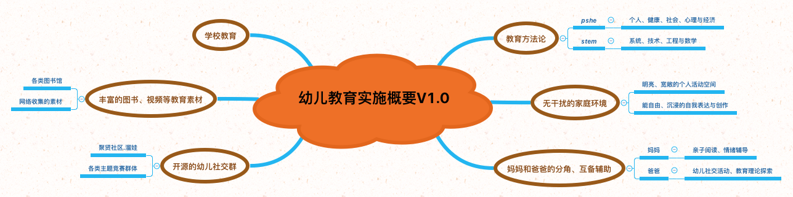

# Geekids.分阶段教育实施概要

## 幼儿园阶段教育实施概要

## 小学阶段教育实施概要

## 初中阶段教育实施概要

## 参考文献

1. [Personal, social, health and economic (PSHE) education](https://www.gov.uk/government/publications/personal-social-health-and-economic-education-pshe/personal-social-health-and-economic-pshe-education)
2. [Policy statement: relationships education, relationships and sex education, and personal, social, health and economic education](https://www.gov.uk/government/uploads/system/uploads/attachment_data/file/595828/170301_Policy_statement_PSHEv2.pdf)